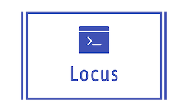

<div align=center>

<p> Run languages in docker sandbox</p>
</div>

---

## Technologies 

1. Golang for [Locus Runner](https://github.com/itsjwala/locus/tree/master/runner)

2. Golang for [Web](https://github.com/itsjwala/locus/tree/master/web)

3. Vanila HTML, CSS, JS(& JQuery) for [frontend](https://github.com/itsjwala/locus/tree/master/web/frontend) 

4. Docker for Infrastructure

## Getting started

Checkout [docs](https://itsjwala.github.io/locus) for complete details


## Usage


### Prerequisite

1. Install [Docker](https://docs.docker.com/engine/install/) ( thats it :smile: )

### Installation and Setup

1. start locus 

```sh
make run 
```

2. To Stop the web container send SIGTERM `ctrl ^ c`


3. clear the images that were created 

```sh
make clear
```

## Contributing

If you'd like to contribute, please fork the repository and use a feature
branch. Pull requests are warmly welcome. 


## Issues

Github [Issue](https://github.com/itsjwala/locus/issues) tracker

## Authors

* [@Jigar](https://github.com/itsjwala)
* [@Bhavna](https://github.com/bhavnavarshney)

## Licensing

[WTFPL](http://www.wtfpl.net/)


---

1. beautify UI

2. draft linkedin post

3. screenshot in readme
