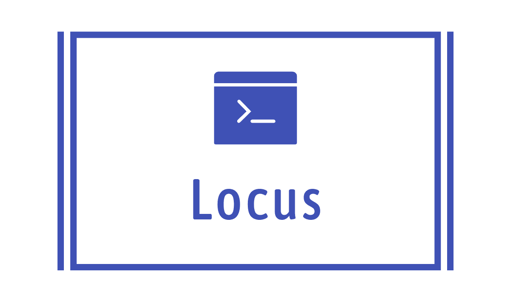
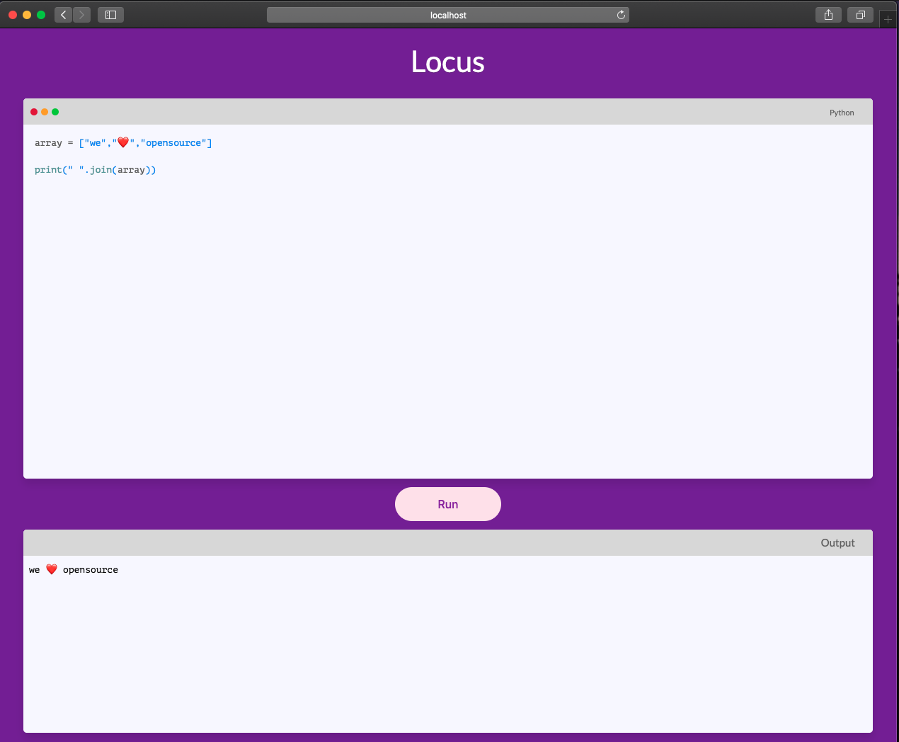

### Locus



### Run Languages in Docker containers 

The likes of *Hackerrank*, *Hackerearth*, *LeetCode*, *CodeChef* e.t.c uses [unix namespace](https://en.wikipedia.org/wiki/Linux_namespaces) isolation so they can run your submitted code and output it to you without damaging their infra with malicious code. This Project Demonstrates similar attempt of making such namespace isolation using Docker other being [LXC](https://en.wikipedia.org/wiki/Linux_namespaces#Adoption)

<p align="center">

</p>

---

### Usage


#### Prerequisite

1. Install [Docker](https://docs.docker.com/engine/install/) ( thats it :smile: )

#### Installation and Setup

1. start locus 

```sh
make run 
```

2. To Stop the web container send SIGTERM `ctrl ^ c`


3. clear the images that were created 

```sh
make clear
```


### Supported Languages

1. Python
2. NodeJS

> Add more Language following this [guide](extension.md)

### TechStack

---
<div align="center">
<div>


</div>
<br>
<div>
 

</div>


</div>
