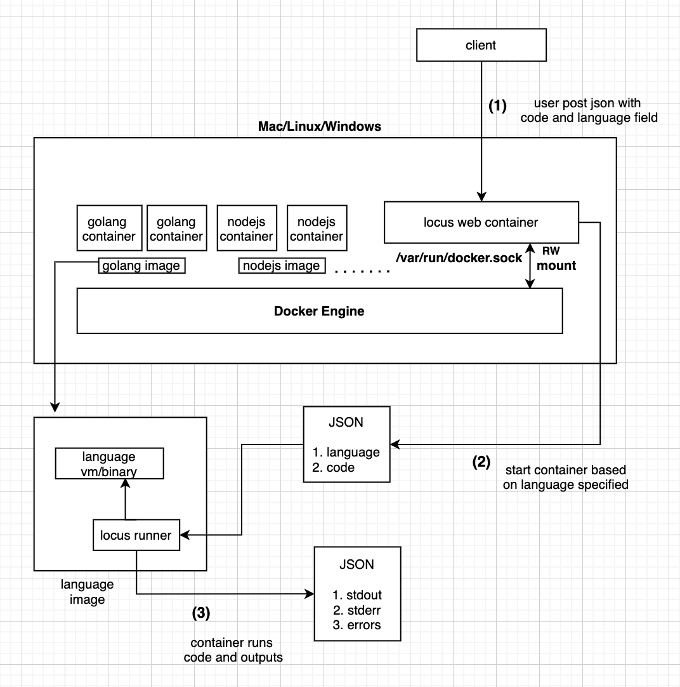

### Architecture Diagram





---

[Web Server](https://github.com/itsjwala/locus/tree/master/web) serving the HTTP request runs on containers **alongside** the language containers thats gonna being spawned based from Web container depending on incoming request from client. For this to work we need to have that environment setup inside **web container** to interact with Docker host, we do this by mounting [Docker Socket](https://medium.com/better-programming/about-var-run-docker-sock-3bfd276e12fd) inside our web container in [rw](https://github.com/itsjwala/locus/blob/master/Makefile#L6) mode.


---


### Components

#### Locus Runner

Locus Runner is a [golang binary](https://github.com/itsjwala/locus/blob/master/runner/locus_runner.go) executable 

a) which takes json argument input with field **language** and **code**  sample below

```json
{
  "language" : "python",
  "code" : "print(\"hello world\")"
}
```
b) [create file](https://github.com/itsjwala/locus/blob/master/runner/utils.go#L36) inside container with content of **code**

c) spawns a shell with runtime specified by [language](https://github.com/itsjwala/locus/tree/master/runner/languages) and waits for the program to finish 

d) outputs systematic json 


```json
{
 "stdout" : "hello world\n",
 "stderr" : "",
 "error" : ""
}
```

Benefit of using locus runner is it abstracts away all the input output logic with docker language runtimes, and we can interact to only to locus runner interface easily.

#### Docker Images for Languages which holds runtime

This are simple docker language images with one thing additional is it [embeds](https://github.com/itsjwala/locus/blob/master/runner/languages/python/Dockerfile) out locus runner for the benefit mentioned above.

We should have all the language runtime images build and stored in docker host so the Web Server can spawn container from using it. 

we build image using a simple [shell script](https://github.com/itsjwala/locus/blob/master/runner/gen_images.sh) which does the following

a) Build Locus runner itself in golang container

b) loops to all language directory and build language images embedding the locus runner binary and making it as entrypoint

#### Web Server 

Simple Golang [HTTP server](https://github.com/itsjwala/locus/blob/master/web/server.go) which based on incoming request creates the container.


#### Frontend Web Client

Simple Frontend UI used from [codepen](https://codepen.io/kazzkiq/pen/xGXaKR) 


